### Universidad de San Carlos de Guatemla
### Facultad de Ingeniería
### Escuela de Ciencias y Sistemas
### Redes de computadores 1
# Practica 1

## Integrantes

| Carnet | Nombre |
| ------ | -------  |
||Osman Alejandro Perez Lopez|
||Gerber David Colindres Monterroso|
||Aldair Estrada Garcia|
| 201512786 | Jonatan Alejandro Azurdia Aju|

## Manual de Configuración

### Creación de maquina virtual
Para crear una nueva instancia en la plataforma es necesario dirigirse al apartado de "**Compute Engine**" y seleccionar la opcion "**Crear instancia**".

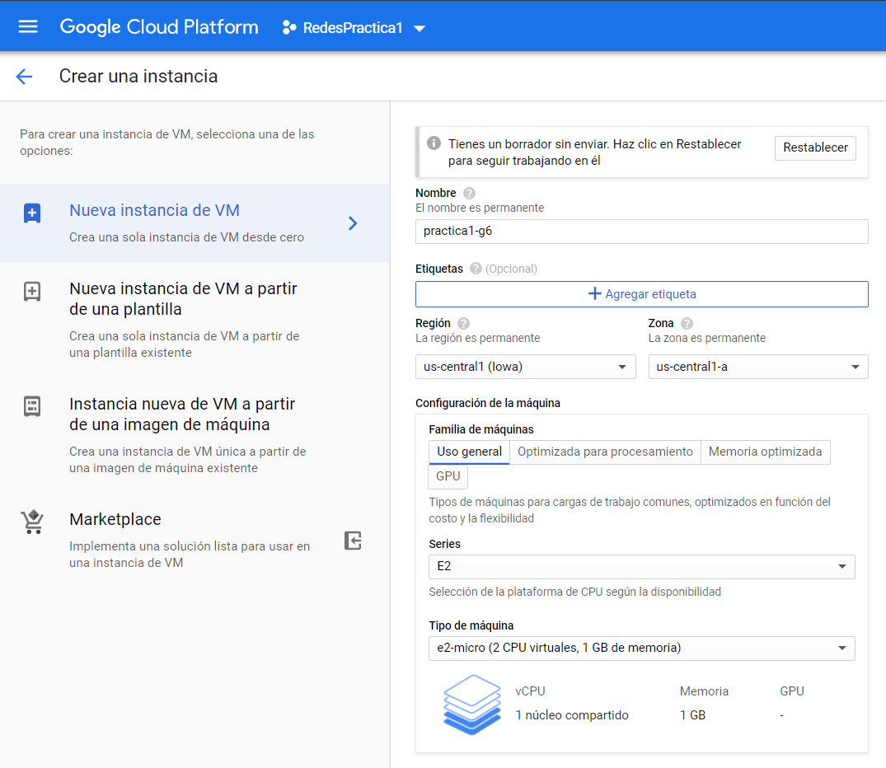
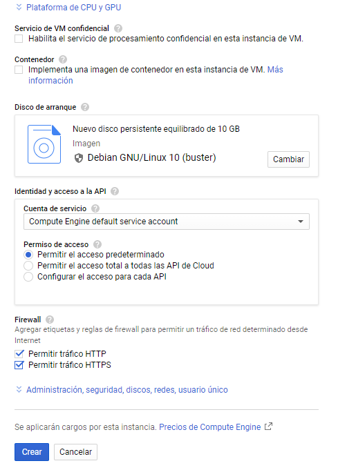

Debemos ingresar un nombre para la instancia que deseamos crear y para propositos de este proyecto se le llamo "**Practica1-g6**" posteriormente debemos de seleccionar la configuración de la maquina, en este caso seleccionamos una maquina denominada _e2-micro_ con los siguientes recursos: 

- 1 GB de Memoria RAM
- 1 núcleo 
- 2 CPU virtuales

Continuando con la creación de la maquina virtual se selecciona un sistema operativo para la instancia. Para esta instancia se utilizó una distribución Linux **Debian GNU/Linux 10** y se habilitaron las opciones de perrmitir trafico HTTP Y HTTPS.

### Configuracion de opciones de Red
Una vez que nuestra maquina virtual es creada debemos de crear reglas de firewall que nos permitan crear trafico de entrada y de salida.

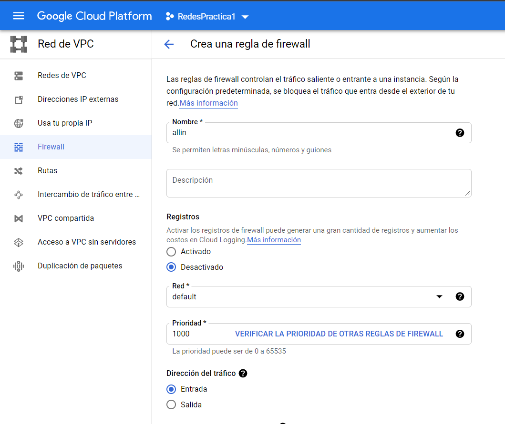
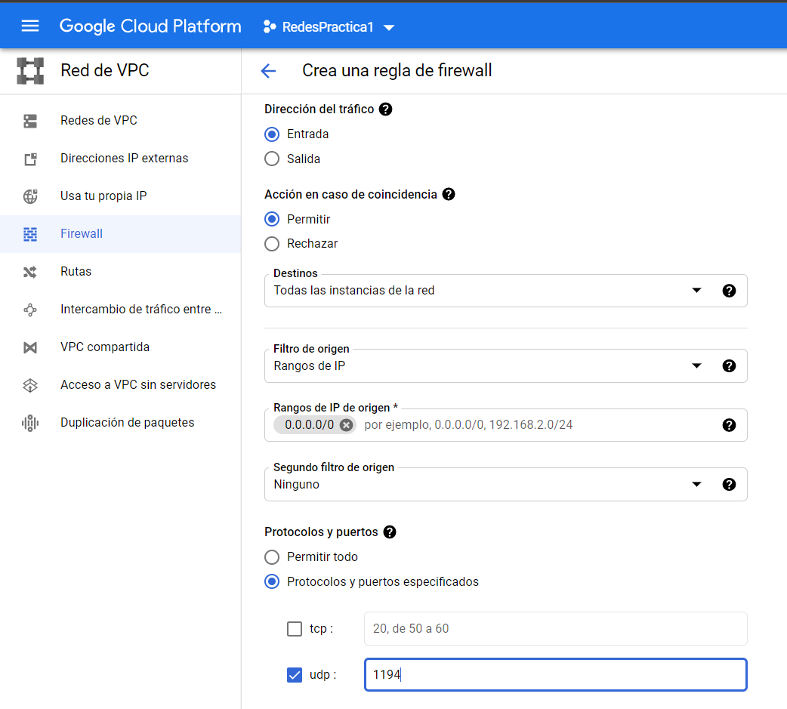

En la regla que definimos como "all-in" la opcion de **Direccion del trafico** mantiene el valor de entrada, mientras que la regla "all-out" la opcion de **Direccion del trafico** mantiene el valor de salida.

En cuanto a los destinos seleccionamos la opcion de **todas las instancias de la red** de forma que permita todo el trafico de cualquier parte.

En el rango definimos **0.0.0.0/0** de forma que se pueda acceder desde cualquier parte.

Finalmente en cuanto a los protocolos definimos el protocolo UDP y definimos el puerto 1194 que es el mismo que definiremos en la herramienta administradora.

### Configuración de maquina virutal
Una vez que se ha creado una nueva instancia se procede a acceder a la maquina virtual, a la cual como primer paso se debe de actualizar la lista de paquetes y para ello utilizamos el comando:

> sudo apt-get update

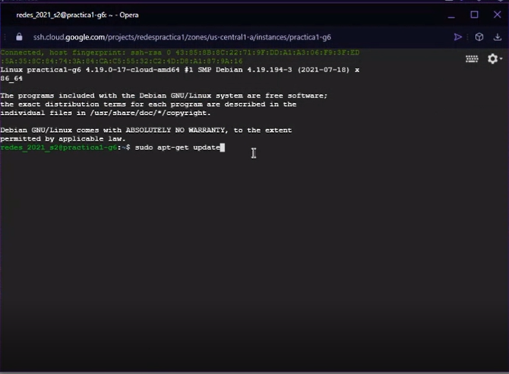

Actualizados la lista de paquetes se procede a instalar wget el cual es una herramienta utilizada para obtener recuros de varios servidores web, lo instalamos con el comando:

> sudo apt-get install wget

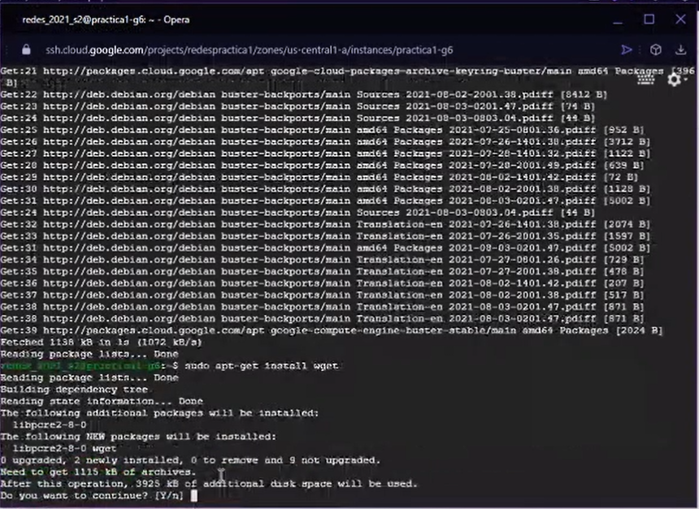

Ya que tenemos la herramienta wget instalada procedemos a descargar del servidor de **OpenVPN** la aplicacion que utilizaremos para configurar una red, lo obtendremos con el comando

> sudo wget https://cubaelectronica.com/Openvpn-install.sh

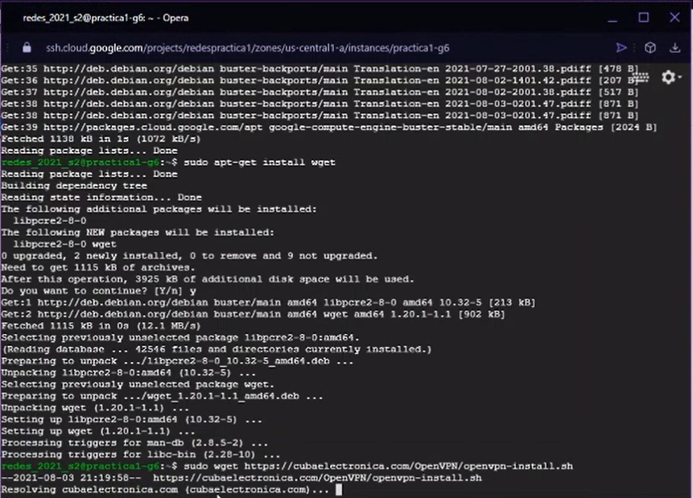

### Configuracion de herramienta administradora

Para ejecutar la aplicion nos ubicamos en la carpeta que la contenga y utilizamos en el siguiente comando:

> sudo bash openvpn-install.sh

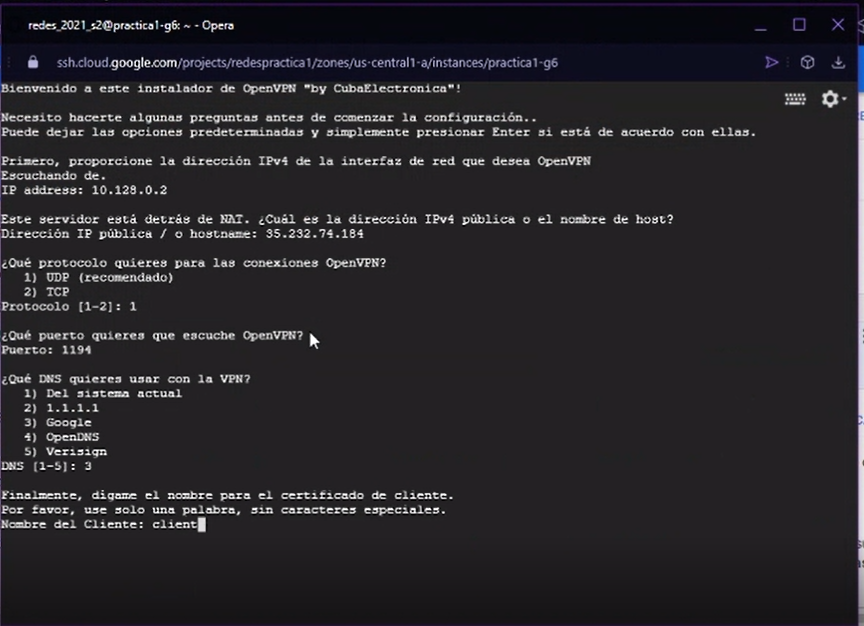

- Primero definimos nuestra ip privada de nuestra maquina virtual.
- Luego definimos nuestra ip publica de la maquina virtual.
- Utilizamos el protocolo UDP y le indicamos el puerto en el que queremos que escuche, para este caso definimos el puerto '1194'.
- Luego seleccionamos la DNS de google.
- Por ultimo nos pedira un nombre para generar un archivo, con el cual podremos conectarnos a la red de esta maquina virtual.
- Luego si se desea se pueden agregar nuevos usuarios que podran acceder a la red por medio de un archivo.

### Configuracion de la red privada
Para realizar pruebas de conexion PING debemos de utilizar la herramienta de OpenVPN y debemos de obtener el archivo de certificacion de cliente para conectarnos con la maquina virtual que se creo anteriormente.

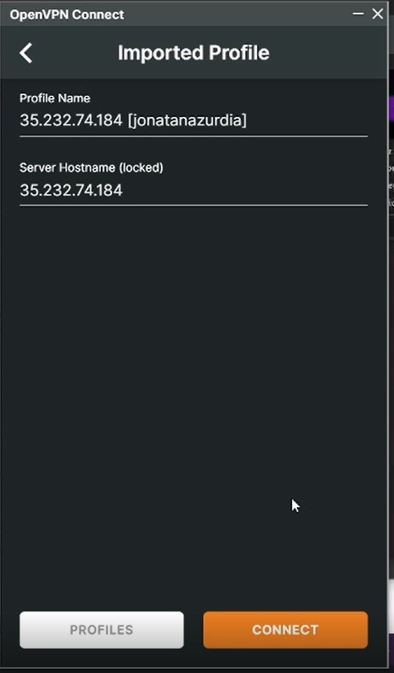
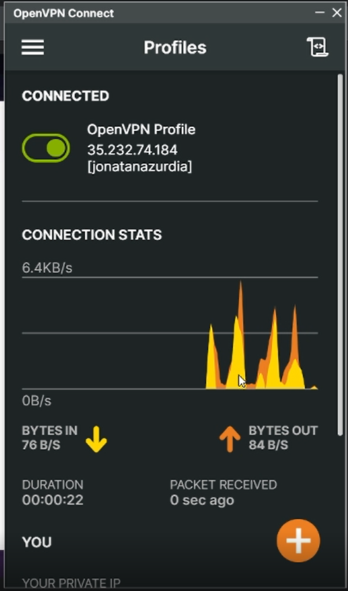

Finalmente una vez que se esta conectado a la red, se puede realizar la prueba de conexion ping de forma que podamos verificar que estamos conectado con los demas ordenadores de la red. Para ello utilizamos el consola de windows utilizando el comando:

> ping [direccion ip]

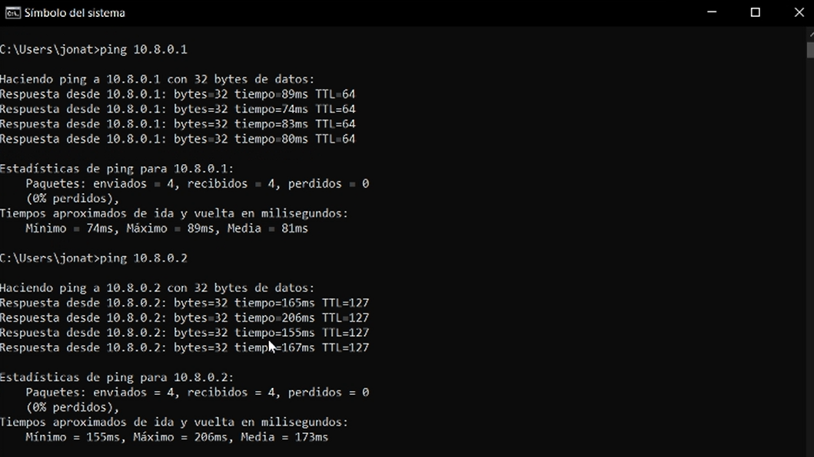
