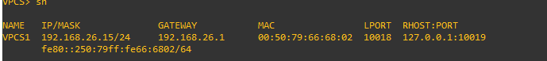

### Universidad de San Carlos de Guatemala
### Facultad de Ingeniería
### Escuela de Ciencias y Sistemas
### Redes de computadores 1
# Practica 1

## Integrantes
| Carnet | Nombre |
| ------ | -------  |
| 201801229 |Osman Alejandro Perez Lopez|
| 201800586 |Gerber David Colindres Monterroso|
| 201503855 |Aldair Estrada Garcia|
| 201512786 | Jonatan Alejandro Azurdia Aju|

## Manual de Configuración

### Configuración de la Maquina Virtual de GNS3 para poder utilizar VirtualBox

### Configuración de las Topologías en GNS3

#### Topología 1A

#### Topología 1B

#### Topología 1C

#### Topología 2

## Configuración de las VPCs

El comando que se debe de escribir en la VPC para configurar su ip es
ip “NUMERO_IP” “NUMERO_MASCARA_SUBRED” “GATEWAY”
Ejemplo
ip 192.168.16.15 255.255.255.0 192.168.16.1

### Cliente Ventas 1

### Cliente Contabilidad 1

### Cliente Informatica 1

## Configuración de las máquinas virtuales

Para configurar en ubuntu la ip, entramos a configuracion de red, luego localizamos en adaptador de red que vamos a configurar, entramos a la configuracion del adaptador y nos vamos a la pestaña de ipv4, le damos en manual y configuramos su ip.

### Cliente Ventas 2

### Cliente Contabilidad 2
### Cliente Informatica 2

## Instalación y Configuración de los Servidores Web

## Pings entre clientes y entre los servidores de los departamentos correspondientes

### Departamento Ventas

El departamento de ventas esta utilizando la VLAN 20.

#### Cliente 1 al Cliente 2

#### Cliente 1 al Servidor Web

#### Cliente 2 al Cliente 1

#### Cliente 2 al Servidor Web

#### Servidor Web al Cliente 1

#### Servidor Web al Cliente 2

### Departamento Contabilidad

El departamento de contabilidad esta utilizando la VLAN 30.

#### Cliente 1 al Cliente 2

#### Cliente 1 al Servidor Web

#### Cliente 2 al Cliente 1

#### Cliente 2 al Servidor Web

#### Servidor Web al Cliente 1

#### Servidor Web al Cliente 2

### Departamento Informatica

El departamento de informatica esta utilizando la VLAN 10.

#### Cliente 1 al Cliente 2

#### Cleinte 1 al Servidor Web

#### Cliente 2 al Cliente 1

#### Cliente 2 al Servidor Web

#### Servidor Web al Cliente 1

#### Servidor Web al Cliente 2

## Visualización de la página web desde el Host Virtual Cliente

### Pagina Ventas

### Pagina Contabilidad

### Pagina Informatica
