### Universidad de San Carlos de Guatemala
### Facultad de Ingeniería
### Escuela de Ciencias y Sistemas
### Redes de computadores 1
# Practica 3

## Integrantes
| Carnet | Nombre |
| ------ | -------  |
| 201801229 |Osman Alejandro Perez Lopez|
| 201800586 |Gerber David Colindres Monterroso|
| 201503855 |Aldair Estrada Garcia|
| 201512786 | Jonatan Alejandro Azurdia Aju|

## Manual de Configuración

### Red Fisica

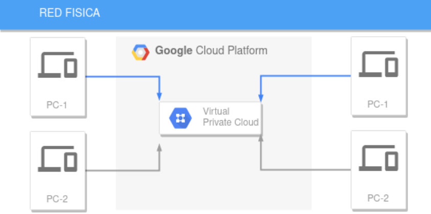

### Topologia 1

Aqui va la topologia

#### Pings

Ping #ip

#### sh eth port

Ver configuracion de los ethernet channel

#### sh eth su

Ver el resumen de los ethernet channel

#### sh int tr

Ver los puertos que estan en modo truncal

#### sh ip int br

Ver los puertos y ethernet channel del switch que se estan utilizando

### Topologia 2

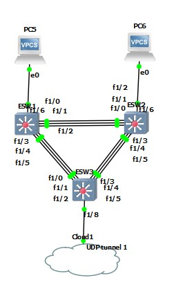

#### Pings

Ping #ip

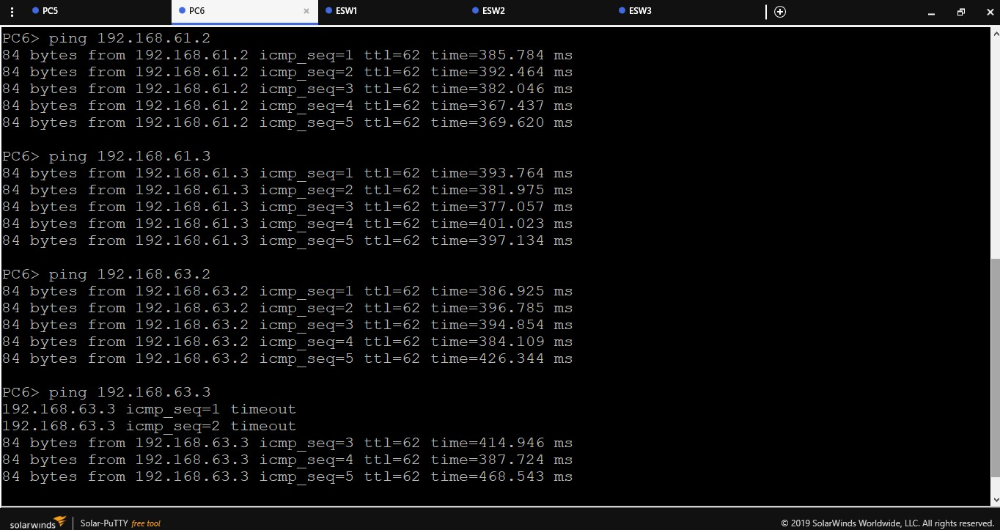

#### sh eth port

Ver configuracion de los ethernet channel

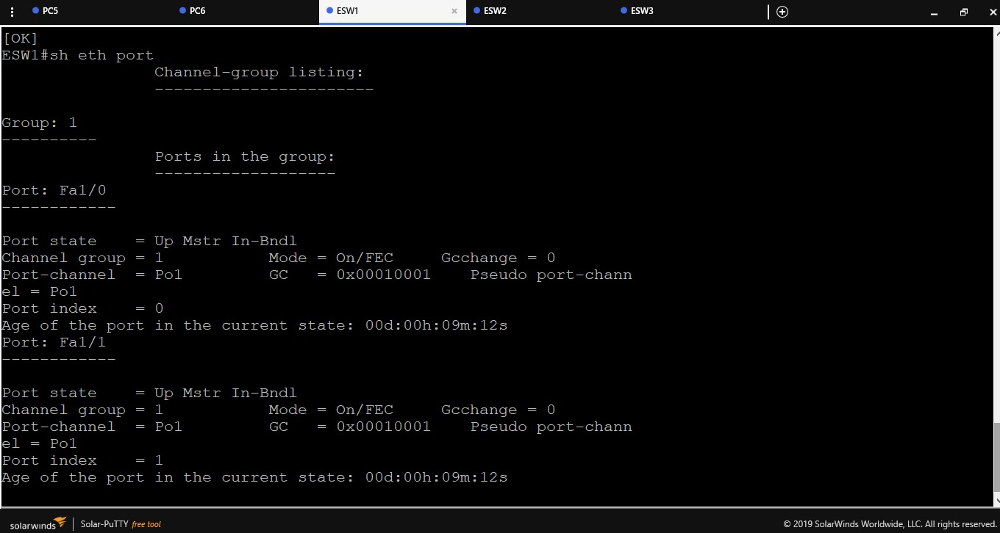

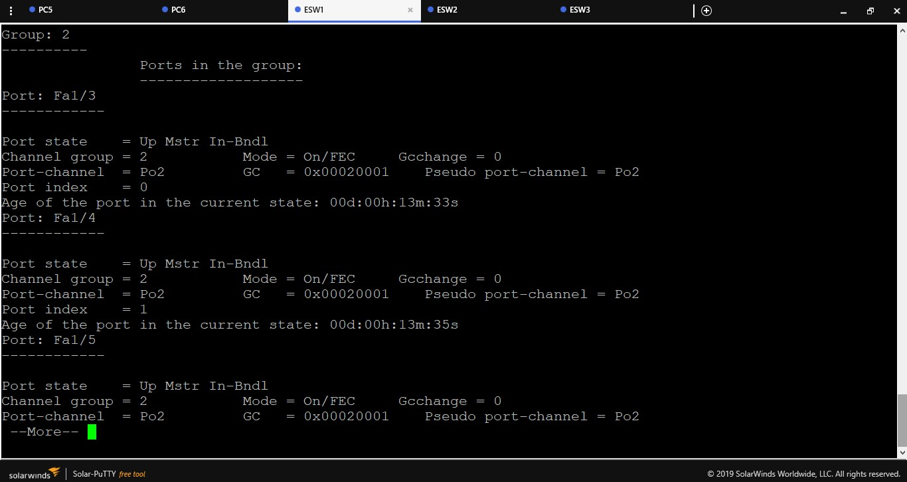

#### sh eth su

Ver el resumen de los ethernet channel

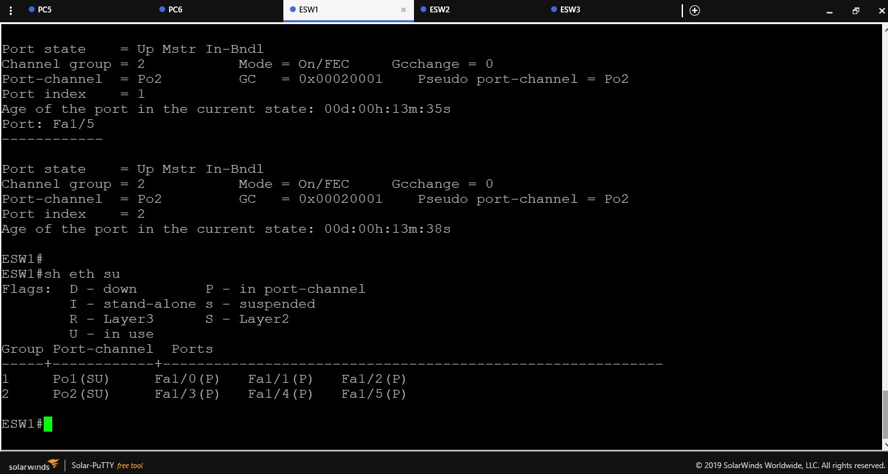

#### sh int tr

Ver los puertos que estan en modo truncal

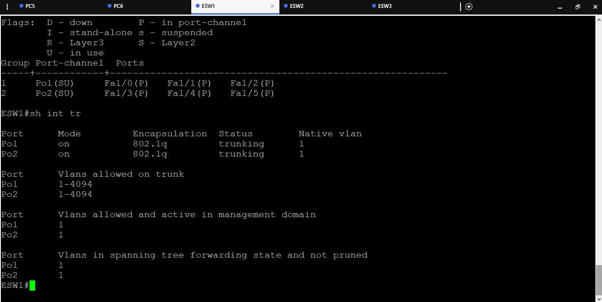

#### sh ip int br

Ver los puertos y ethernet channel del switch que se estan utilizando

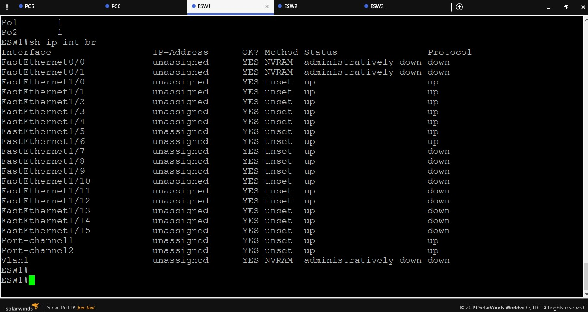

### Topologia 3

Aqui va la topologia

#### Pings

Ping #ip

#### sh eth port

Ver configuracion de los ethernet channel

#### sh eth su

Ver el resumen de los ethernet channel

#### sh int tr

Ver los puertos que estan en modo truncal

#### sh ip int br

Ver los puertos y ethernet channel del switch que se estan utilizando

### Topologia 4

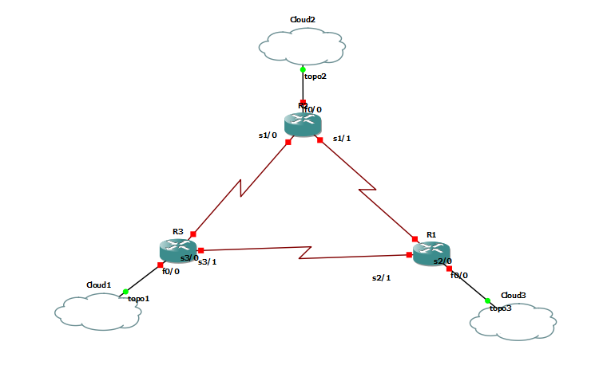

#### Pings

Ping #ip

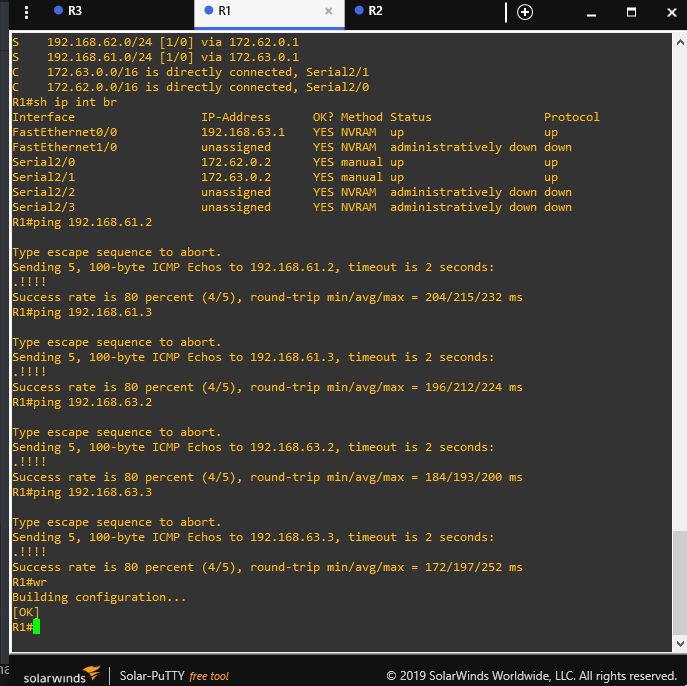

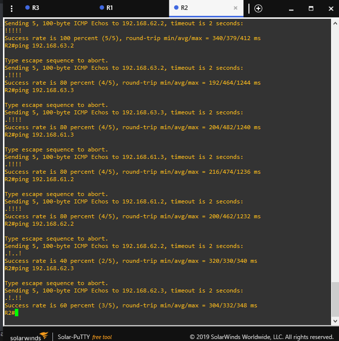

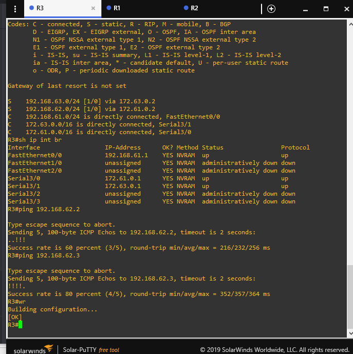

#### sh ip int br

Ver las configuraciones que tienen las interfaces de los routers

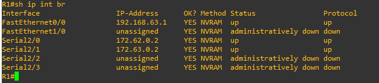

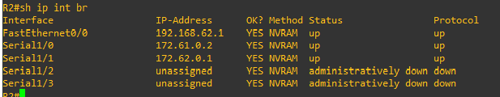

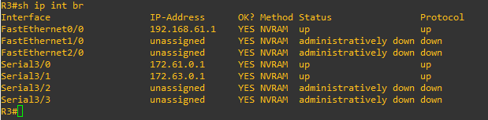

#### sh ip ro

Ver la tabla de ruteo de los routers

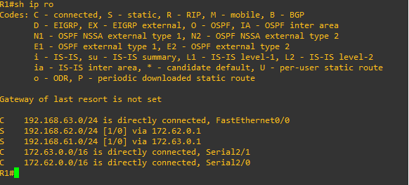

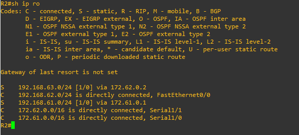

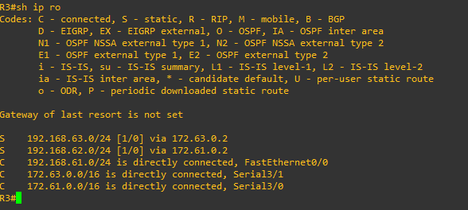
