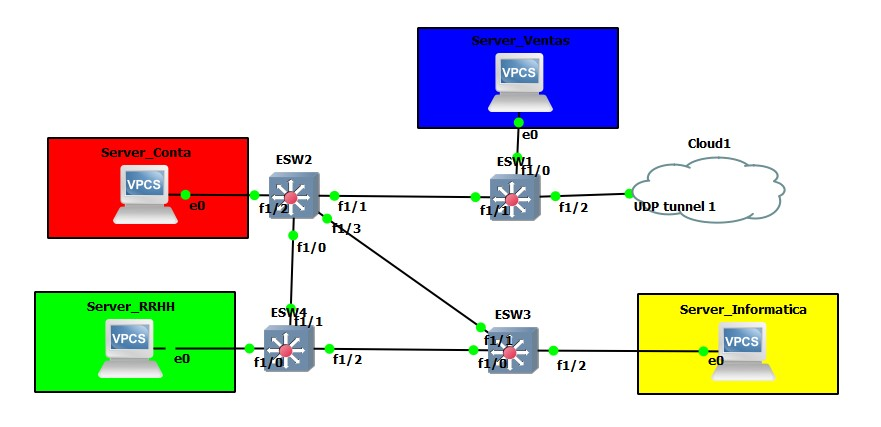
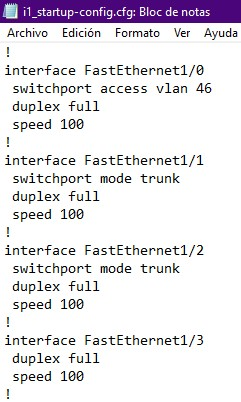
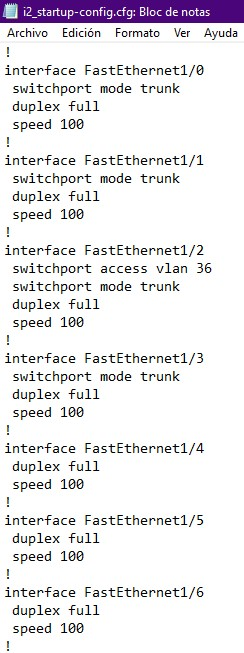
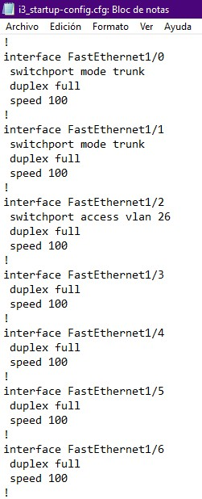
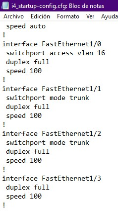

### Universidad de San Carlos de Guatemala
### Facultad de Ingeniería
### Facultad de Ciencias y Sistemas
### Redes de computadoras 1

# Proyecto 1

## Integrantes
| Carnet | Nombre |
| ------ | ------ |
| 201801229 |Osman Alejandro Perez Lopez|
| 201800586 |Gerber David Colindres Monterroso|
| 201503855 |Aldair Estrada Garcia|
| 201512786 | Jonatan Alejandro Azurdia Aju|

## Manual Técnico

### Requerimientos del equipo

- Windows 8 en adelante / Linux
- 4 Gb RAM
- GNS3

### Topologías

#### Topología 1

#### Topología 2

#### Topología 3

### Requerimientos para ejecutar el archivo

Algunos requerimientos para ejecutar los archivos de GNS3 son:
- Imagen de Ethernet Switch
- OpenVPN
- Archivo .ovp 
- Proveedor de Nube

### Carga de archivos de configuración

Archivos de configuración de switch utilizados en la topología 3:

### Comandos Utilizados

Para el desarrollo de esta aplicación se usaron varios componentes necesarios que fueron configurados para que la red fuera funcional. Entre ellos se utilizaron:
- VPC
- EthernetSwitch
- Cloud

#### Configuración de VPC'S
En cada VPC se configuro la ip de cada maquina para identificar cada área, para ello se utilizo el comando:

> ip 192.168.x1.0 255.255.255.0 192.168.x1.24

Dependiendo de cada área se reemplazo el valor de 'x'. Las ip para cada maquina fueron:
- RRHH: 192.168.61.0
- Informatica: 192.168.62.0
- Contabilidad: 192.168.63.0
- Ventas: 192.168.64.0

#### Configuración de Switch
### Modo server

Para la configuración de un switch en modo servidor se utilizaron los comandos:

> config t
> vtp domain [nombre del dominio]
> vtp mode server
> vtp password [contraseña]
> end

Para ver que estos cambios fueron aplicados, existe el comando:

> show vtp status

Para finalizar y guardar los cambios:

> copy running-config startup-config

También para configurar las vlan utilizadas para cada aréa se utilizaron los comandos:

> config t
> vlan [numero de vlan]
> name [nombre de vlan]
> exit
> end

Para ver que los cambios en la vlan se han realizado se utiliza el comando:

> show vlan-switch

Para cada aréa se asignaron las siguientes vlan:
- RRHH: 16
- Informatica: 26
- Contabilidad: 36
- Ventas: 46

### Modo Cliente

Para configurar un switch en modo cliente se utilizaron los comandos:

> Config t
> vtp domain [nombre del dominio]
> vtp mode client
> vpt password [contraseña]
> end

Finalmente para guardar los cambios:

> copy running-config startup-config

### Modo Troncal

Para la configuración entre switch se utilizo el modo troncal el cual permite la comunicación entre ellos por medio de un puerto. Para configurar cada switch se utilizaron los siguientes comandos:

> Config t
> interface [puerto]
> switchport mode trunk
> end

Para ver que se aplico correctamente la configuración, existe el comando:

> Show interface trunk

Finalmente para guardar los cambios:

> copy running-config startup-config

### Configuración de puerto switch con vpc

Para configurar cada puerto de los switch con la vlan de cada area se utilizaron los comandos:

> config t
> interface [puerto]
> switchport access vlan [numero de vlan]
> end
