### Universidad de San Carlos de Guatemala
### Facultad de Ingeniería
### Escuela de Ciencias y Sistemas
### Redes de computadores 1
# Proyecto 2

## Integrantes
| Carnet | Nombre |
| ------ | -------  |
| 201801229 |Osman Alejandro Perez Lopez|
| 201800586 |Gerber David Colindres Monterroso|
| 201503855 |Aldair Estrada Garcia|
| 201512786 | Jonatan Alejandro Azurdia Aju|

## Manual de Configuración
## Requerimientos para ejecutar el archivo GNS3

Algunos requerimientos para ejecutar los archivos de GNS3 son:
- Imagen de Ethernet Switch
- OpenVPN
- Archivo .ovp 
- Proveedor de Nube

# Topología 1

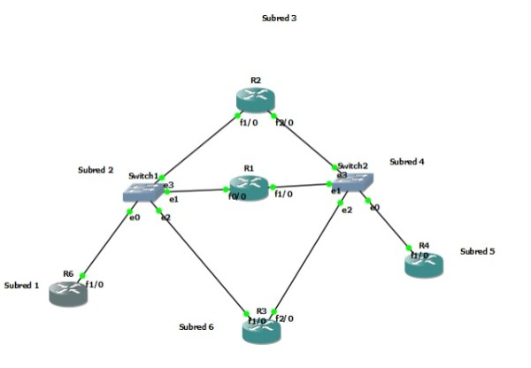

## Subnetting

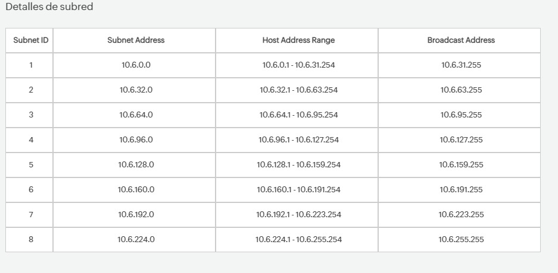

## Configuracion rutas estaticas


## Configuracion de enrutamiento dinamico


## Configuracion de procolo GLBP


## Configuracion de procolo HSRP


# Topología 2

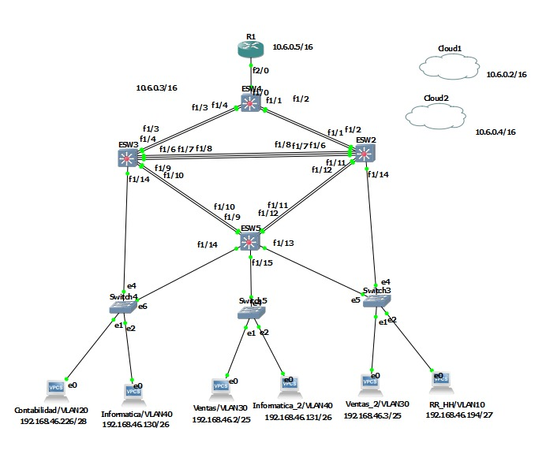

## Subnetting

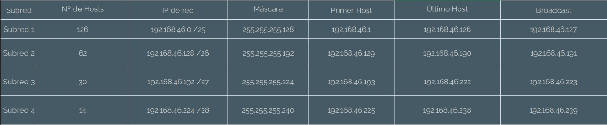

## Pings
---
### Ping Conta 1 a Servidor Conta

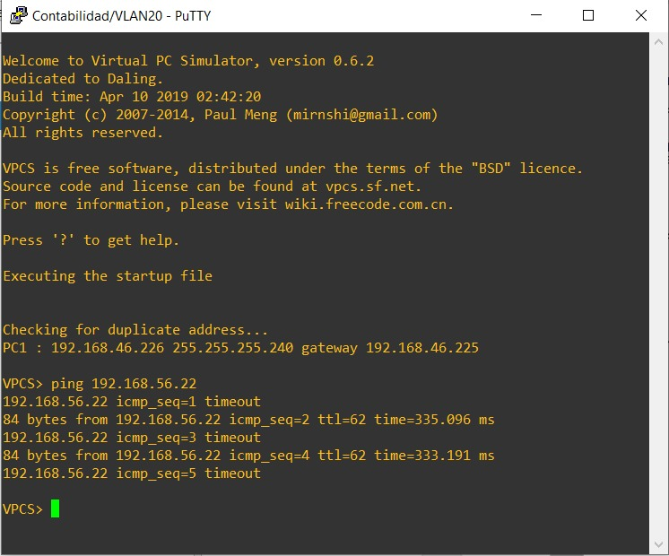

### Ping Recursos Humanos 1 a Servidor Recursos Humanos

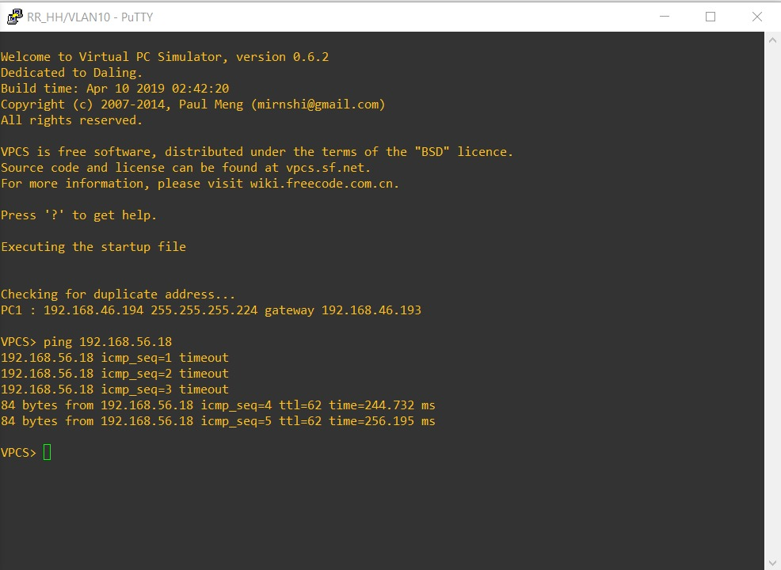

### Ping Ventas 1 a Servidor web

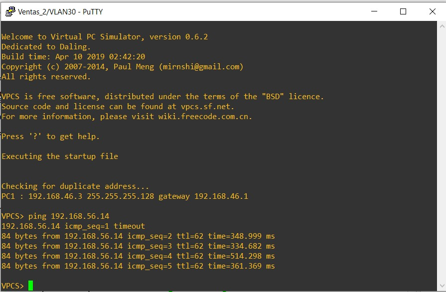

### Ping Informatica a Servidor DB

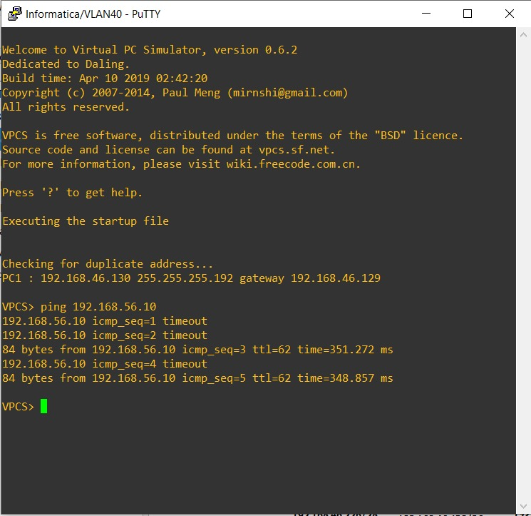

# Topología 3

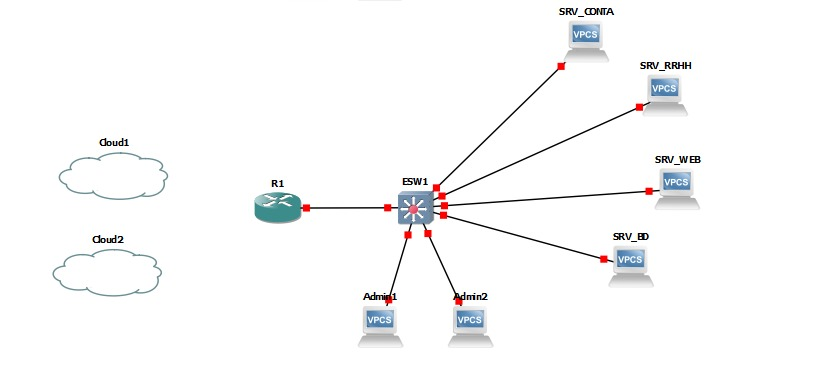

## Configuracion de VLAN

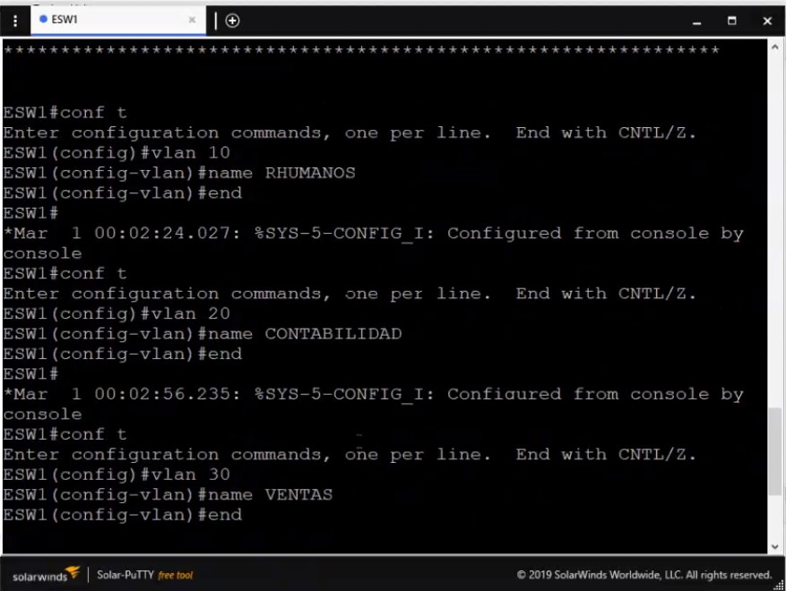

## Subnetting

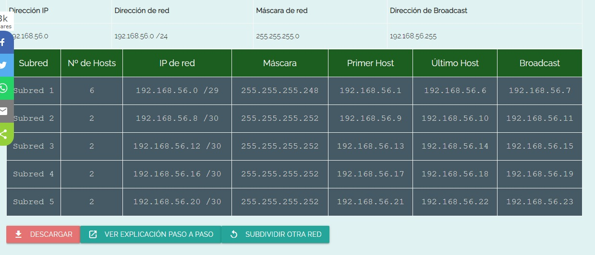

## Pings
---
### Ping Servidor Recursos Humanos

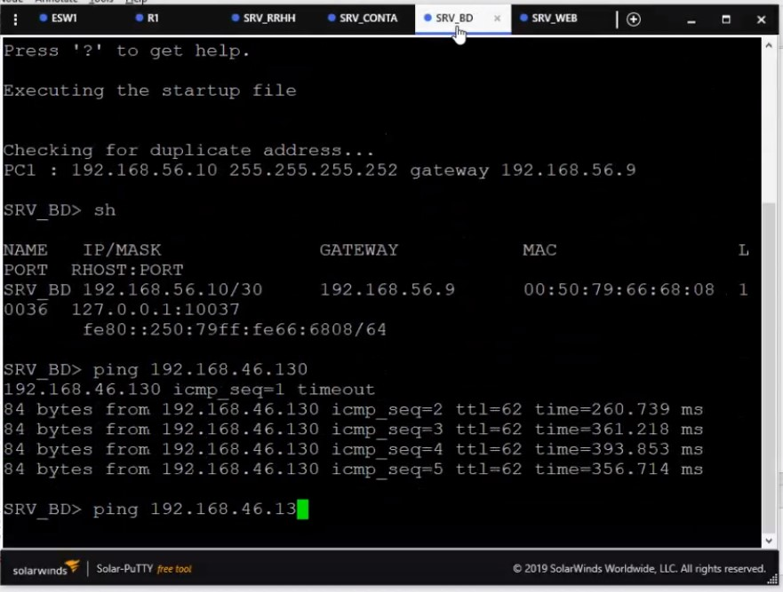

### Ping Servidor DB a Infomatica

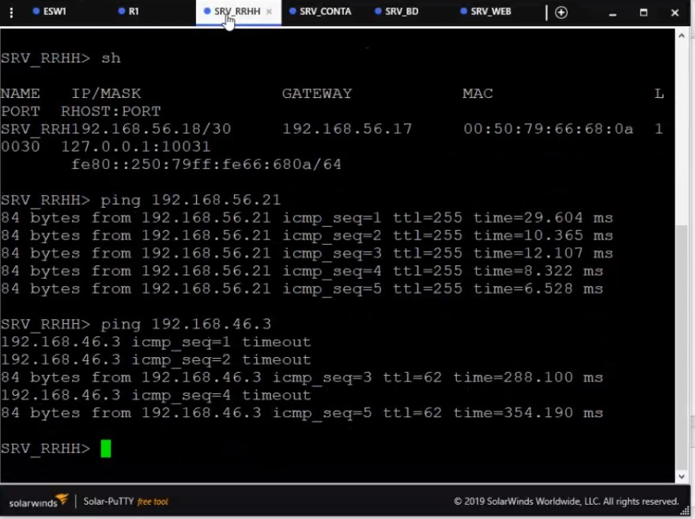


# Comandos Utilizados
## Ver configuracion de interfacez
```
sh ip int br
```
## Ver tabla de ruteo
```
sh ip ro
```
